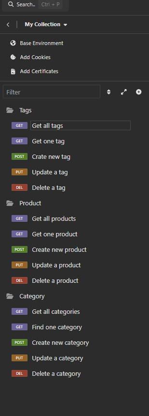

Title: 
E-Commerce-Back-End

Description:
In this challenge, I have created a back-end server operations for an e-commerce website. In this back-end operations, users can view categories, create, update and delete a category - users can view tags of the products, create, update and delete a tag - users can view products, create, update and delete a product using Insomnia as a route-testing tool.  
How to Run:
1 - Run the application of your choice such as "VS Code" then, please copy the repository link below and clone the repository on your local machine by typing the following in the terminal "git clone "copied repository link".
2 - Click on the folder you have just created (It should be named "EMPLOYEE-TRACKER-BYPOSTGRESQL),
3 - Right click on "server.js" and open an integrated terminal,
4 - Please type "npm install" in the terminal and press enter to install the necessary packages,
5 - Type in "psql -U postgres" and press enter and enter your password. If you have a different connection to the postgres, please use those credentials to connect to postgres,  
6 - Then execute file schema.sql by typing the following in the terminal "\i db/schema.sql" and press enter to create the department, role and employee tables,
7 - Once finished, you can disconnect from postgres by typing the following command in the terminal "\q" and press enter,
8 - In the same terminal, please type in either "node seeds/index.js" and press enter to seed the database with some preliminary data,
9 - In the same terminal, please type in either "npm start" or "node server.js" and press enter to start the application,
10 - Once server is started, please run the application "Insomnia",
11- You can test the routes from http requests inside the application with below routes.

Note: Please follow the link below for a video demonstration. 

________________________________________________________________________________

HTTP Requests

For Tags: 

GET - localhost:3001/api/tags (to get all tags),
GET - localhost:3001/api/tags/:id (to get tag by id),
Post - localhost:3001/api/tags (create a new tag),
Example JSON Body: 
{
	"tag_name" : "Test",
},
PUT - localhost:3001/api/tags/:id (to update a tag by id),
DELETE - localhost:3001/api/tags/:id (to delete a tag by id).

For Products:

GET - localhost:3001/api/products (to get all products),
GET - localhost:3001/api/products/:id (to get product by id),
Post - localhost:3001/api/products (create a new product),
Example JSON Body: 
{
  "product_name": "Test",
  "price": 200.00,
  "stock": 3,
  "category_id": 1
},
PUT - localhost:3001/api/products/:id (to update a product by id),
DELETE - localhost:3001/api/products/:id (to delete a product by id).

For Categories:

GET - localhost:3001/api/categories (to get all categories),
GET - localhost:3001/api/categories/:id (to get category by id),
Post - localhost:3001/api/categories (create a new category),
Example JSON Body: 
{
  "category_name": "Test"
},
PUT - localhost:3001/api/categories/:id (to update a category by id),
DELETE - localhost:3001/api/categories/:id (to delete a category by id).

________________________________________________________________________________

Github Repository : https://github.com/minikozort/E-Commerce-Back-End.git
Mock-up Video Link : https://www.loom.com/share/8f5897c047714210a427d0bbef54e764?sid=bc8bc075-4dfa-44a0-a2dd-2836eb620999